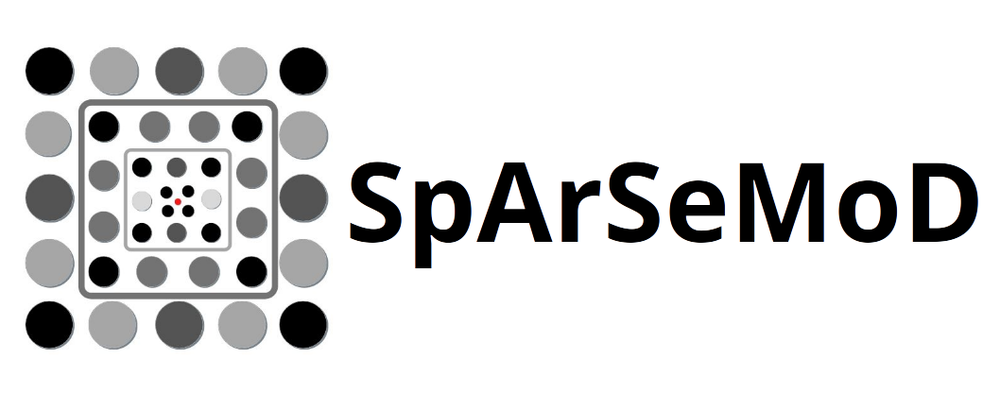
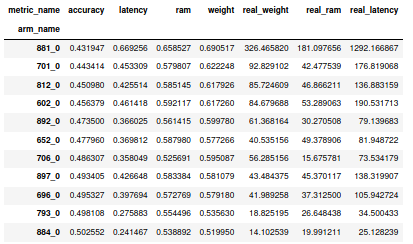
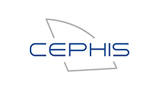

<p align="center">
    <br>
    
    <br>
<p>

<p align="center">
    <a href="https://github.com/BCJuan/SpArSeMod/blob/master/LICENSE">
        
    </a>
        <a href="https://github.com/BCJuan/SpArSeMod/releases/tag/">
        
    </a>
        <a href='https://sparsemod.readthedocs.io/en/latest/?badge=stable'>
        
    </a>
        
</p>
<h3 align="center">
<p>Neural Network Development for Microcontrollers
</h3>

## Table of contents
* [Description](#description)
* [Installation](#installation)
* [Usage](#sample-use-and-examples)
* [Improvements](#improvements)
* [Support](#support)
* [License](#license)

# Description

Adaptation and extension of . The present code delivers neural networks optimized according to performance error, working memory (~RAM), model size (~Flash) and latency.

The configuration space (or search space) of the network, that is, the components that build it up are elligible by the user: you can build up networks with CNNs, RNNs or whatever structure you like. However, you will have to build the network builder: the function that will specify the concrete network from a search space point. 

Build with [PyTorch](https://pytorch.org/), [GPyTorch](https://gpytorch.ai/)  and [Ax](https://ax.dev/).

The result obtained after running a SpArSeMoD process is the group of best networks (Pareto frontier networks):

<p align="center">
    <br>
    
    <br>
<p>


# Installation

1. Clone this repository
2. Install conda environment: `conda env create -n sparse -f sparse.yml`
    1. Alternatively, install packages directly from pip
3. run `pip install .` 

# Sample use and examples

The folder `examples/` contains several separate functioning examples. Each folder is a different example and contains all the examples to run a sessions of SparseMod.

To adapt to your specific problem, try to imitate one of those examples. The components needed are:
1. Create a Space Search function which returns a `SearchSpace` object, as in `/examples/cnn_cifar_example/cnn.py`.
2. Create a network builder, as in `examples/cnn_cifar_example/cnn.py`, which needs to accept the following parameters: `parametrization, classes=10, input_shape=None`
3. Build you dataset and data pipeline as in `examples/cnn_cifar_example/load_data.py`.
4. Build the main call function as in `examples/cnn_cifar_example/main.py`.
4. Complete `config.cfg`, with all the necessary parameters .
5. Run `python main.py`
6. Wait until the process completes. You will have to check the results to see which has been the best network.

The process described is for a CNN based network and the [CIFAR 10 Binary](http://manikvarma.org/code/LDKL/download.html).

For a more and complete guide for SpArSeMoD usage, you can checkout the [Documentation](https://sparsemod.readthedocs.io/en/latest/)
## Results

1. The models will be placed in the folder specified in the configuration as `root`, and there, a `models` folder will be created, where all the models will be stored. Only pareto models are saved.
2. Results for the evaluations will be placed in the specified folder in the configuration. It consists of a `csv` where results are saved as dataframe, a `json` for the experiment and a txt for the time taken for the whole experiment.
3. In the file `examples/result_inspection.ipynb`, an example of analysing the results is exemplified.
4. In case yo want to recover the exact structure of your chosen netwrok, you will ahve to rerun SpArse to reload the experiment and inspect the network. An example of such process is found in `examples/cnn_cost_example/read_experiment.py`


# Todo list

+ [ ] Add tests for
    + [x] Model building, training and testing
        + [ ] Solve problem of image being smaller than needed
    + [ ] Quantization and pruning
    + [ ] Sobol stage
    + [ ] Gaussian process based stage
    + [ ] Morphisms
+ [x] Complete documentation for
    + [x] Tutorial
    + [x] General description and concepts
    + [x] Load it in Readthe Docs
    + [x] install documentation
+ [x] Include tests in 
    + [x] Travis CI
    + [x] Makefile

+ [ ] Complete `download_data`for tutorial
+ [x] REad the docs problems 
+ [x] Travis Hooks

# Improvements

The next points represent current WIP points considered as weak or defective points of the framework. 

+ [x] Check batch size for GP works
+ [x] Add notebook for selecting best network and inspecting results
+ [ ] When loading the data it should be loaded only up to an index, since we dont want to reload morphed solutions results

This code has a main point of smell:

+ [ ] The json serializer saves almost all that is inside. Experiments end up weighing a lot, like MB-> GB. It woul be needed to extract all the structures outside the experiment to avoid this problem. This would be the worst problem in the code. 

Necessary improvements for the framework:

1. Add raytune distribution
2. Add tolerance checker as stopper

# Citation
If you use SpArSeMod in your work, please cite us as follows:
```
@inproceedings{Borrego-Carazo2020,
address = {Miami, Florida},
author = {Borrego-Carazo, Juan and Castells-Rufas, David and Carrabina, Jordi and Biempica, Ernesto},
booktitle = {19TH IEEE INTERNATIONAL CONFERENCE ON MACHINE LEARNING AND APPLICATIONS (ICMLA)},
publisher = {IEEE},
title = {{Extending SpArSe: Automatic Gesture Recognition Architectures for Embedded Devices}},
year = {2020}
}
```

# Support

If you are having issues, please let us know.
We have a mailing list located at: juan.borrego@uab.cat


# License

The project is licensed under the GNU GLP 3.0 License

# Acknowledgement

This code has been developed by a joint collaboration of 
 <div class="row">
   <div class="column">
    <a href="https://github.com/BCJuan/SpArSeMod/releases/tag/">
        
    </a>    
  </div>
  <div class="column">
    <a href="https://www.uab.cat/en/">
        
    </a>
  </div>
  <div class="column">
    <a href="https://www.uab.cat/web/directory/search/entities-1345675609174.html?param1=1345674960027">
        
    </a>
  </div>
</div> 
